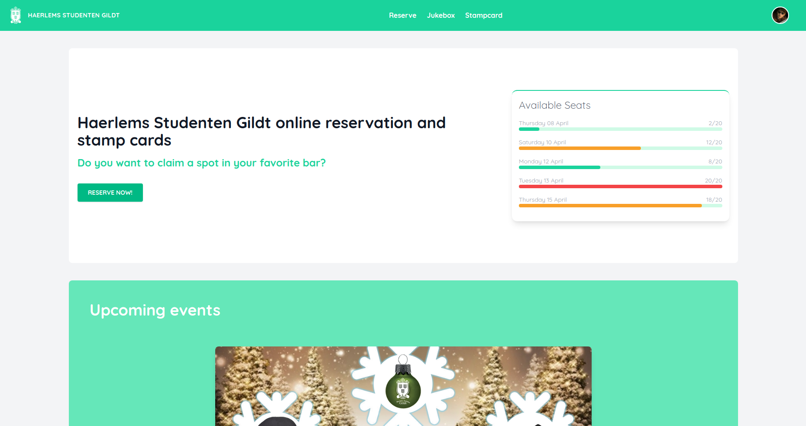

# Haerlems Studenten Gildt online reservation platform backend

## Table of contents

- [Screenshots](#screenshots)
- [Tech](#tech-stack)
- [Lessons](#lessons-learned)
- [Roadmap](#upcoming-features-/-roadmap)
- [Links](#links)
- [Install](#install)
- [Environment Variables](#environment-variables)

## Screenshots



- [More Screenshots](https://drive.google.com/drive/folders/1HsT6ivmhclyFDBUOT6jJvPuzPAPt0Hex?usp=sharing)

## Tech Stack

**Server:** Node, Express, JWT, Sequelize, PostgreSQL, Joi

**Client:** React, TypeScript, Redux, Formik + Yup, Headless UI, Tailwind CSS

## Lessons Learned

What I learned during this project:

- Practice building a MVP in 9 days
- Many to many relations in sequelize
- Working with JWT and Joi

## Upcoming features / Roadmap

- Refresh tokens
- Endpoint for upload user avatar
- Endpoint for guests to cancel their own reservation
- Rate limiters

## Links

- [Project board](https://github.com/DionAlting/portfolio-backend/projects/1)
- [Database diagram](https://dbdiagram.io/d/6049e497fcdcb6230b23a30b)
- [Wireframe Frontend](https://drive.google.com/file/d/1OejX_buUxH4yMAuVMA9yqSkchwT6GkK6/view?usp=sharing)
- [Frontend repo](https://github.com/DionAlting/portfolio-frontend)

## Install

Clone the project

```bash
  HTTPS => git clone https://github.com/DionAlting/portfolio-backend.git
  SSH   => git clone git@github.com:DionAlting/portfolio-backend.git
```

Go to the project directory

```bash
  cd portfolio-backend
```

Install dependencies

```bash
  npm install
```

Start the server

```bash
  npm run server-dev (Nodemon)
  npm run resetDB (Setting up databases)
```

## Environment Variables

To run this project, you will need to add the following environment variables to your .env file

`ELEPHANT_SQL`=YOUR_LINK

`SALT_ROUNDS`=NUMBER

`JWT_SECRET`=YOUR_SECRET

`JWT_EXPIRES_IN`=1h/3h/1d/1w
